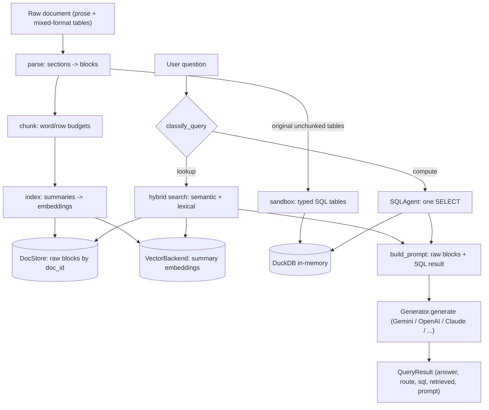
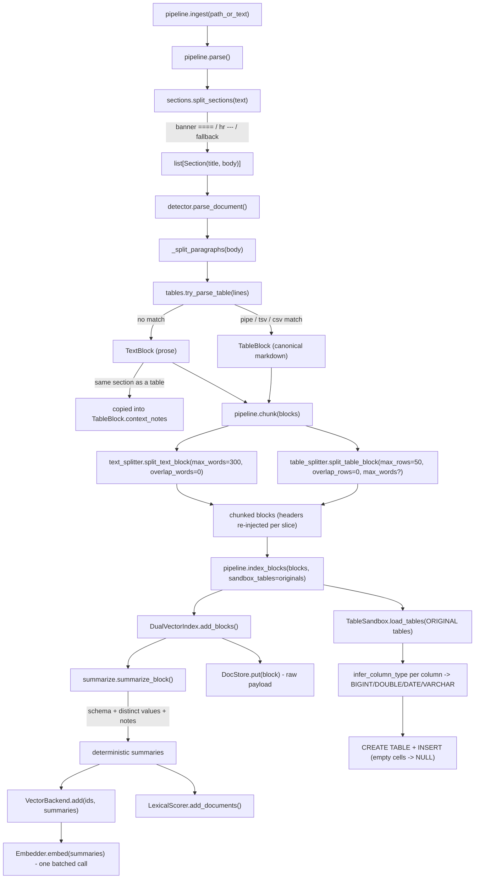
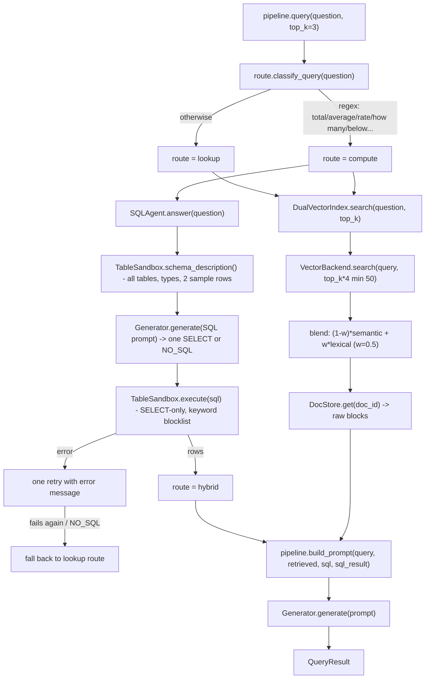

# tablerag — Design Document

tablerag is table-aware RAG infrastructure. It fixes the two failure modes we
proved with the naive TF-IDF baseline on `document2.txt`: (1) chunkers that
shred tables and float headers away from their rows, and (2) LLMs doing mental
math over retrieved fragments. The core ideas are **dual-vector indexing**
(search summaries, answer from pristine payloads) and **deterministic routing
to a SQL sandbox** for quantitative questions.

- [End-to-end data flow](#end-to-end-data-flow)
- [Ingestion flow (methods + data)](#ingestion-flow)
- [Query flow (methods + data)](#query-flow)
- [Components](#components)
  1. [Parsing](#1-parsing--tableragparse)
  2. [Chunking](#2-chunking--tableragchunk)
  3. [Summarization](#3-summarization--tableragsummarizepy)
  4. [Indexing](#4-indexing--tableragindex)
  5. [Retrieval scoring](#5-retrieval-scoring-hybrid-semantic--lexical)
  6. [Routing](#6-routing--tableragroute)
  7. [Compute sandbox](#7-compute-sandbox--tableragcompute)
  8. [Generation](#8-generation--tableraggeneratepy)
  9. [LangChain integration](#9-langchain-integration--tableragintegrationslangchainpy)
  10. [Evaluation harness](#10-evaluation-harness--tableragevals)
- [Design principles](#design-principles)

---

## End-to-end data flow

One document goes to **two stores with different jobs**: the dual-vector index
(find the right block) and the DuckDB sandbox (compute exact numbers). A query
takes one of three routes: `lookup` (retrieval only), `hybrid`
(retrieval + SQL), or fallback from a failed SQL attempt.

## Ingestion flow

Every method involved in `TableRAGPipeline.ingest()`, with the data each one
produces. `ingest()` is literally `parse()` -> `chunk()` -> `index_blocks()`;
the three stages are public so chunking (free, deterministic) can be inspected
or cached before embedding (the only API-calling stage).

## Query flow

---

## Components

### 1. Parsing — `tablerag/parse/`

**Strategy: detect structure, never guess.** A paragraph is a table only if it
passes a strict format check; everything else stays prose. False positives
would poison the SQL sandbox, so detection errs conservative.

- `sections.split_sections(text)` — three strategies, tried in order:
  `====` banner blocks (title enclosed between two banner lines), `\n---\n`
  horizontal rules (title = first line), whole-document fallback. The section
  title becomes metadata on every block from that section — no more floating
  header chunks.
- `tables.try_parse_table(lines)` — tries three formats on each blank-line
  separated paragraph: **pipe** (bordered `| a | b |`, unbordered `a | b`, or
  compact `a|b`; markdown `---` separator rows dropped), **TSV**, **CSV**
  (requires identical comma count per line and short header cells). All rows
  must have identical column count. Output is normalized to **canonical
  markdown** so every downstream component handles exactly one table shape.
- `detector.parse_document(text)` — orchestrates the above. Key trick: if a
  section contains both a table and prose, the prose is copied into the
  table's `context_notes` (and kept as its own TextBlock). Correction
  footnotes travel with their table — this is what makes restated values win
  over stale ones.
- Irregular data (JSONL key=value lines, free-text tickets) deliberately stays
  `TextBlock`: retrievable, but never loaded into SQL.

### 2. Chunking — `tablerag/chunk/`

**Strategy: different physics for prose and tables.** Prose meaning spills
across sentence boundaries; table rows are independent records. So the two
splitters differ in unit, overlap default, and context re-injection.

| | Prose (`split_text_block`) | Tables (`split_table_block`) |
| --- | --- | --- |
| Unit | words, split at sentence boundaries | rows |
| Budget | `max_words=300` (single oversized sentence hard-split by words) | `max_rows=50`; optional `max_words` derives a row cap from avg words/row (stricter wins) |
| Overlap | `overlap_words=0` default, sliding-window when set | `overlap_rows=0` default (rows independent — overlap buys little) |
| Context kept per slice | section title annotated `(part i/n)` | **headers re-injected on every slice**, section title annotated `(rows a-b)`, `context_notes` copied |

Chunking is deterministic and free (no API calls). Critical invariant: the
**SQL sandbox always receives the original unchunked table**, so slicing only
affects the retrieval copy — aggregations never see a fragment.

### 3. Summarization — `tablerag/summarize.py`

**Strategy: deterministic, zero LLM calls.** Instead of paying an LLM to
summarize each table (the textbook multi-vector approach), the summary is
built mechanically: section title + column names + up to 24 distinct values
per column + `context_notes`. This captures exactly what table queries mention
(column names, SKUs, dates, store IDs), is fully reproducible, and costs
nothing. Text blocks summarize as themselves (truncated at 1,200 chars for the
embedding only — the stored payload is never truncated). An LLM summary mode
can be layered on later if a corpus needs it.

### 4. Indexing — `tablerag/index/`

**Strategy: dual-vector.** What gets *searched* (summary embeddings) is
decoupled from what gets *answered from* (raw blocks). The vector never
contains the table; it points at it.

- `DualVectorIndex.add_blocks()` — writes each block to the `DocStore`
  (dict keyed by `doc_id`, JSON save/load) and its summary to the
  `VectorBackend` and `LexicalScorer`.
- `VectorBackend` protocol (`add`, `search`, `__len__`) makes the vector side
  pluggable:
  - `InMemoryBackend` (default) — embeds via the supplied `Embedder`
    (one batched call) and scores brute-force with a selectable metric:
    `cosine` (default) / `dot` / `euclidean` (mapped to `1/(1+dist)`). Fine
    to ~5k blocks; numpy/FAISS is the planned upgrade.
  - `LangChainVectorStoreBackend` — duck-typed wrapper over any LangChain
    VectorStore (Chroma, FAISS, Qdrant...); the store embeds with its own
    embeddings and scores with its own metric. tablerag only writes
    summaries + `doc_id` pointers there; raw payloads stay in the DocStore.
- The `Embedder` protocol (`embed(texts) -> vectors`) is provider-agnostic:
  `GeminiEmbedder` (native), `LangChainEmbedder` (any LangChain `Embeddings`),
  `CallableEmbedder` (any function), and `HashEmbedder` (deterministic offline
  embedder for tests / quota-free runs). There is no default embedder, but the
  requirement is deferred: construction and the pure stages (parse/chunk) work
  without one, and a clear error is raised only when embedding is first needed
  (`index_blocks`/`search`). Generation likewise has no default and is enforced
  lazily at `query()`.

### 5. Retrieval scoring (hybrid semantic + lexical)

**Strategy: embeddings for meaning, exact tokens for identifiers.** Table
queries hinge on strings embeddings blur (`net_rev_usd`, `DE-442`,
`2025-06-14`), so `DualVectorIndex.search()`:

1. pulls `max(top_k*4, 50)` semantic candidates from the backend,
2. re-scores each as `(1-w)*semantic + w*lexical` with `lexical_weight=0.5`,
3. returns the top-k **raw blocks** (never summaries).

The `LexicalScorer` is IDF-weighted token overlap with two tricks: compound
identifiers emit their parts (`net_rev_usd` -> `net, rev, usd`, so "net
revenue USD" matches), and prefix matching bridges abbreviation drift
("revenue" ~ "rev") at 0.8 weight. `lexical_weight=0` disables it.

### 6. Routing — `tablerag/route/`

**Strategy: deterministic regex, no LLM, no latency.** `classify_query()`
labels a question `compute` if it matches aggregation intent patterns
(`total`, `average`, `rate`, `how many`, `highest`, `below`, `across all`, ~30
patterns), else `lookup`. Compute is attempted only when the sandbox has
tables; a failed SQL attempt degrades gracefully to lookup. The wager: a cheap
router that is right most of the time beats an agentic loop that is expensive
always — and a wrong `compute` label costs only one extra LLM call before
falling back.

### 7. Compute sandbox — `tablerag/compute/`

**Strategy: LLM writes SQL once; the database does the math.**

- `TableSandbox` — ephemeral in-memory DuckDB. Each original `TableBlock`
  becomes a typed table: names sanitized from section titles
  (`NORTH AMERICA — weekly...` -> `north_america`), column types inferred
  from cell values (`BIGINT`/`DOUBLE`/`DATE`/`VARCHAR`), empty cells become
  real `NULL`s (so a missing value is reported missing, not hallucinated).
- Safety: `execute()` accepts a single `SELECT`/`WITH` statement only —
  statement stacking rejected, DDL/DML keyword blocklist
  (`INSERT|UPDATE|DELETE|DROP|CREATE|...`). No `exec()`, no arbitrary Python.
- `SQLAgent.answer()` — one LLM call with the full schema description
  (tables, typed columns, 2 sample rows, notes) asking for one SELECT or
  `NO_SQL`; on execution error, a configurable number of retries
  (`sql_max_retries`, default 1) with the error message fed back; then give
  up and fall back to lookup. Deliberately not a ReAct loop.
- The SQL prompt is user-customizable with an **append-don't-replace**
  default: `sql_instructions` (domain rules — units, fiscal calendars,
  business definitions) and `sql_examples` (few-shot question/SQL pairs) are
  appended while the base safety contract ("output ONLY SQL", "SELECT only",
  `NO_SQL` fallback) stays intact; `sql_prompt_template` fully replaces the
  prompt (`{schema}`/`{question}`/`{instructions}` slots) for callers who
  explicitly want to own the contract.
- The executed SQL and its exact rows are injected into the final prompt
  with "trust this computed result over manual arithmetic".
- Known gap (from WTQ eval): casts fail on dirty cells like `'121 seasons'`;
  `TRY_CAST` in the SQL prompt is the planned fix.

### 8. Generation — `tablerag/generate.py`

**Strategy: provider-agnostic via a narrow `Generator` protocol**
(`generate(prompt) -> str`, plus a `model` label). Nothing in the pipeline
knows about a specific vendor — it just calls `.generate()`. Built-in
implementations: `GeminiGenerator` (native `google-genai`), `LangChainGenerator`
(wraps any LangChain chat model — OpenAI, Anthropic, Gemini, Cohere, local),
and `CallableGenerator` (any `fn(prompt) -> str`). There is **no implicit
default**: you pass a generator (see `tablerag/providers.py` for one-liners, or
`TableRAGPipeline.from_env()` for a Gemini setup). Embeddings and generation are
independent slots, so you can mix vendors (e.g. Claude answers, OpenAI
embeddings).

The prompt is **user-configurable, with a persona/contract split**: the
user-owned `system_prompt` (default `DEFAULT_SYSTEM_PROMPT`: analyst persona,
"prefer authoritative tables", "say don't know") carries tone/domain/language
and can be set on the constructor or per query; the tablerag-owned
`FORMAT_CONTRACT` (tables are canonical markdown with section titles and
notes; aggregates may be computed from rows) is always appended so a custom
persona cannot break table reading. Layout = system + contract + retrieved
raw blocks rendered with section titles and notes + the optional SQL result
("trust this computed result") + question. A `prompt_builder` callable
replaces the entire layout for full control (few-shot, non-English scaffolds,
custom rendering). Step-by-step logging mirrors the original `rag.py` so
retrieval and generation failures are visible.

### 9. LangChain integration — `tablerag/integrations/langchain.py`

**Strategy: adapter, not dependency.** Core `tablerag/` never imports
LangChain; the adapter imports it lazily (`pip install tablerag[langchain]`).

- `TableRetrieverManager` — `ingest()` runs parse -> chunk -> summarize;
  `as_retriever(k)` returns a native `BaseRetriever` (`TableRAGRetriever`)
  whose Documents carry raw markdown + metadata (`doc_id`, `kind`,
  `section`, `score`). Two backends: internal index (hybrid scoring) or a
  user vectorstore (summaries + pointers written there — the
  MultiVectorRetriever pattern without the UUID boilerplate).
- `LangChainEmbedderAdapter` — lets a LangChain `Embeddings` object serve as
  tablerag's embedder.
- Scope note: the LangChain path is retrieval-only; the SQL compute route
  currently lives only in `TableRAGPipeline`.

### 10. Evaluation harness — `tablerag/evals/`

**Strategy: score retrieval and generation separately** so failures point at
the right stage (fetch vs reason).

- Loaders return `(samples, contexts)`: built-in `doc2` (10 hand-verified
  stress queries, offline), `wtq` (WikiTableQuestions via HF, with parquet
  mirror fallback), `t2` (T²-RAGBench financial text+table). Conversion
  from raw records is factored into pure functions, testable without network.
- Metrics: `recall_at_k` (golden block in top-k), `mrr_at_k` (1/rank of first
  golden hit), `answer_match` (normalized containment + numeric match with 1%
  tolerance, k/m/b suffixes, percent-vs-fraction).
- `Evaluator.run()` ingests each context under `source=context_id`, scores
  hit ranks against `golden_sections`/`golden_sources`, and optionally
  generates + scores answers. CLI: `python -m tablerag.evals doc2|wtq|t2`.
- Honest caveats: small-sample runs retrieve against a small corpus (easier
  than the papers' full-corpus setting), and `answer_match` is fuzzier than
  official per-dataset scorers — current numbers are directional, not
  leaderboard-comparable.

---

## Design principles

1. **Deterministic wherever possible.** Parsing, chunking, summarization,
   routing, and math are all LLM-free. LLM calls happen in exactly two
   places: writing one SQL statement, and phrasing the final answer.
2. **The payload is sacred.** Raw tables are never embedded, truncated, or
   fragmented on the answer path; vectors and summaries are only pointers.
3. **Complete tables for math.** Chunking applies to the retrieval copy only;
   DuckDB always loads the original grid.
4. **Safety over flexibility.** SELECT-only SQL beats sandboxed Python
   `exec()`; a conservative table detector beats an eager one.
5. **Infrastructure, not framework.** Zero-config in-memory defaults, with
   protocols (`Embedder`, `VectorBackend`) and adapters (LangChain) at every
   boundary. tablerag owns ingest + retrieval + compute; the user keeps their
   vectorstore, LLM, and chain.
